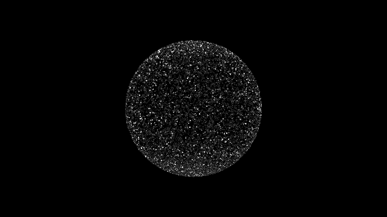

GitHub: [https://github.com/kenjiSpecial/tubugl-particle](https://github.com/kenjiSpecial/tubugl-particle)

### [#00 - particle point](./app00/index.html)

[codes](https://github.com/kenjiSpecial/tubugl-particle/blob/master/examples/app00) | [source for ParticlePoint](https://github.com/kenjiSpecial/tubugl-3d-shape/blob/master/src/proceduralRoundingCube.js)

all examples were made with [tubugl](https://github.com/kenjiSpecial/tubugl)